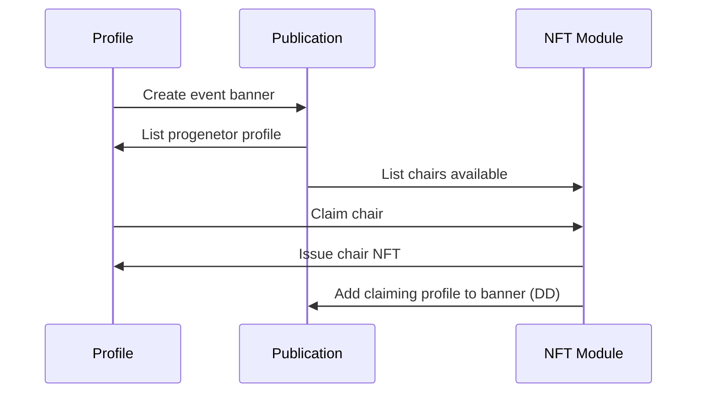

# Select Screen Social

WIP dApp to dynamically generate banners based on social NFT claims.  

## [Template generated from Nuxt 3 Awesome Starter ](https://github.com/viandwi24/nuxt3-awesome-starter/
a 
## License
This project is licensed under the MIT license, Copyright (c) 2022 Alfian Dwi Nugraha. For more information see the [LICENSE](LICENSE.md) file.
